# 4. Plotting data

To plot data with R, we can use two strategies

* use the **built-in functions from the base R**: using these functions, we can plot boxplots, heatmaps, scatter plots, etc...
* use the **functions from the `ggplot2`** package. 

As part of the `tidyverse` package and eco-system, `ggplot2` has implemented a new way to consider plotting. It is a very powerful way to create beautiful plots. However, the learning curve is somewhat steep... Therefore, we will restrict ourselves to the basic R functions, and refer to numerous tutorials (such as in [DataCamp](https://learn.datacamp.com/courses/intermediate-data-visualization-with-ggplot2)) regarding ggplot.

Let's start by reading in the cleaned data from the last chapter:


```r
dat = read.delim("https://tinyurl.com/87tpvd4c", stringsAsFactors = TRUE)
```

We load the `tidyverse` package again


```r
library(tidyverse)
```

## 4.1 Histograms

Histograms are used to represent the distribution of continuous values.


```r
hist(dat$stab.glu, xlab = "Stabilized Glucose concentration in blood", main = "")
```

> Change the value of `main` and see how it changes the plot


> Add the parameter `breaks = 50` in the above lines of code and see what happens. 
> Try different values for `breaks` like `10, 20, 75, 100` and try to interpret the differences. 

Type `help("hist")` to see more details about the histogram function in R. Also try plotting histograms and summaries for other continuous numeric data in our diabetes dataset.

We can also add additional information to the histogram, for example the value of the mean or median:


```r
hist(dat$stab.glu, xlab = "Stabilized Glucose concentration in blood", main = "")
abline(v = mean(dat$stab.glu), lty = 3, lwd = 2, col = "red")
```

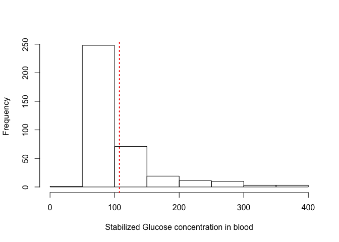<!-- -->

> Play with the values of the parameters `lty`, `lwd` to see the effect; 
> Check the help pages with ?`graphical parameter`


## 4.2 Density plots

An alternative way to represent distributions is through a density plot; think of it as a smoothing of the histogram!


```r
plot(density(dat$stab.glu), xlab = "Stabilized Glucose concentration in blood", main = "")
```

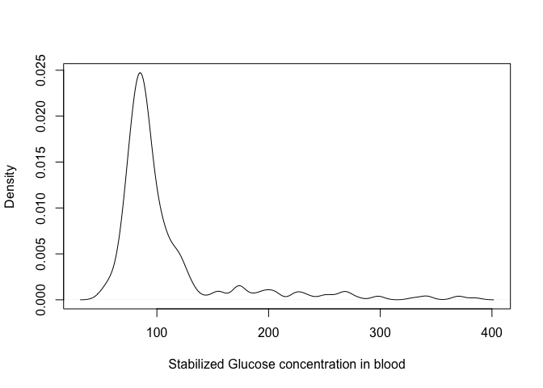<!-- -->

You can control the level of smoothing using the parameter `bw` in the `density` function; try the following:


```r
plot(density(dat$stab.glu, bw = 1), xlab = "Stabilized Glucose concentration in blood", 
    main = "")
```

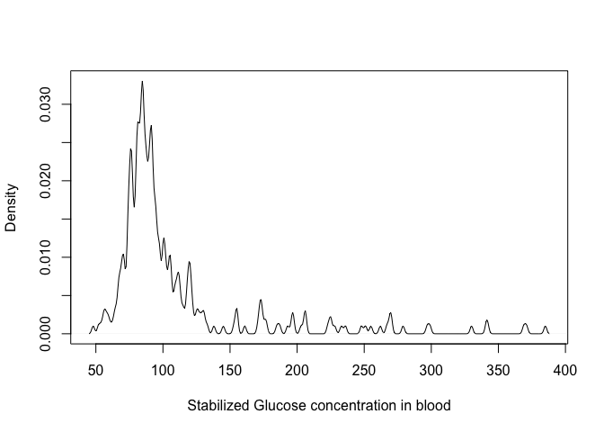<!-- -->

> Play with the `bw` parameter to see how is changes the density!


> Using the function `abline` plot a vertical line highlighting the glucose concentration of `300 units`.

<details>
<summary><b>Click for the solution! </b></summary>


```r
plot(density(dat$stab.glu), xlab = "Stabilized Glucose concentration in blood", main = "")
abline(v = 300, lwd = 2, lty = 3, col = "red")
```

</details>
<p></p>

## 4.3 Boxplots

Boxplots are great to compare distributions between groups; for example, we could compare the weights of men vs. women:

* first, we need to filter men and women


```r
## this is the solution using the dplyr functions (we will see another )
weight.w = dat %>% filter(gender == "female") %>% pull(weight)
weight.m = dat %>% filter(gender == "male") %>% pull(weight)
```

> Use the `summary` function to check mean/median/quartiles of these 2 vectors!

<details>
<summary><b>Click for the solution! </b></summary>


```r
summary(weight.w)
```

```
   Min. 1st Qu.  Median    Mean 3rd Qu.    Max. 
   99.0   145.0   170.0   174.9   200.0   325.0 
```

```r
summary(weight.m)
```

```
   Min. 1st Qu.  Median    Mean 3rd Qu.    Max. 
  105.0   159.0   179.0   182.6   201.0   320.0 
```

</details>
<p></p>

* now we can use the `boxplot` function; if we want to display several vectors of values side by side, we need to organise then inside a **list**:


```r
## define a list with name `weights`
weights = list(women = weight.w, men = weight.m)

## now use the boxplot function
boxplot(weights)
```

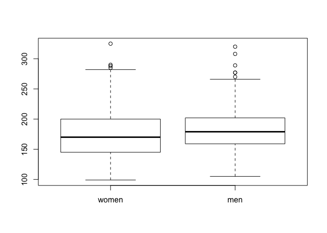<!-- -->

> By the way, do you know how to interpret a boxplot?

<details>
<summary><b>Click here for an explanation!</b></summary>

The boxplot gives an indication about the most important features of a distribution

* the thick horizontal line in the box represents the **median** value
* the top of the box represents the **75th percentile**; hence, 25% of the values in the dataset have a **larger** value
* the bottom of the box represents the **25th percentile**; hence, 25% of the values in the dataset have a **smaller** value
* the **whiskers** which extend above/below the box have a length at most 1.5 times the height of the box; however, they extend at most to the largest value (upper whisker) or smallest value (lower whisker).
* the individual dots are the **outliers**, which are outside the whisker.

</details>
<p></p>

## 4.4 Violin plots

A similar, but more informative way to display this is using **violin plots**. In addition to displaying median/quartiles, the violing plot gives an idea about the shape of the distribution (like in the density plots).
If we want to display violin plots, we need to load the package `vioplot`


```r
library(vioplot)
```


```r
vioplot(weights)
```

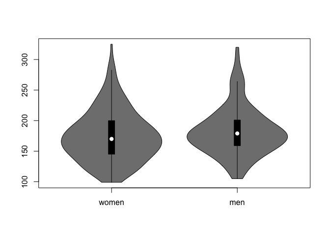<!-- -->

> Make a violin plot showing the distribution of weights of the patients coming from Buckingham vs. Louisa

<details>
<summary><b>Click here for the solution!</b></summary>


```r
## we can use the `split` function here
weights = split(dat$weight, dat$location)

## violin plot
vioplot(weights)
```
</details> 
<p></p>

## 4.5 Scatter plots

So far, we have looked at one variable at a time. But sometimes, it is interesting to check the dependency between variables. This can be done using a **scatter plot**.
For example, we could look at the dependency between weight and height, or weight and cholesterol!


```r
plot(dat$weight, dat$height)
```

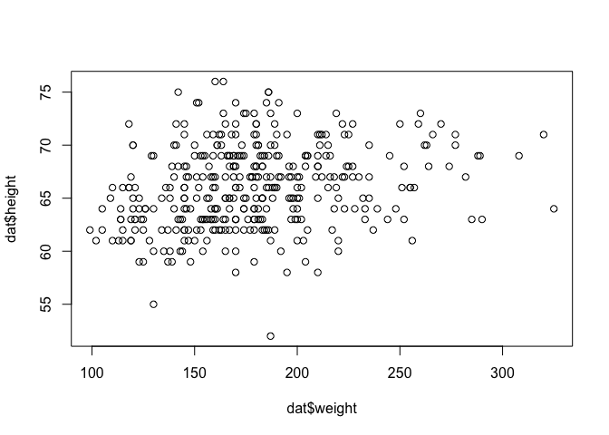<!-- -->

We can make this plot nicer, by adding some parameters to the `plot` function:


```r
plot(dat$weight, dat$height, xlab = "Weight", ylab = "Height", pch = 20, col = "blue", 
    main = "Relation between weight and height")
```

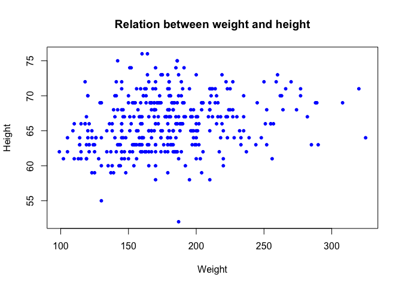<!-- -->

We can add a regression line in this scatter plot, using the `lm` function (`lm` stands for *linear model*)


```r
## we perform the linear regresion, and store the object in the variable `l`
l = lm(height ~ weight, data = dat)

## we can add the regression line using the `abline` line function
plot(dat$weight, dat$height, xlab = "Weight", ylab = "Height", pch = 20, col = "blue", 
    main = "Relation between weight and height")
abline(l, col = "red", lwd = 3)
```

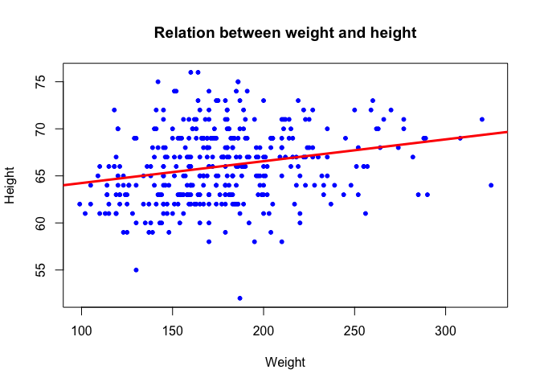<!-- -->

> By the way, what is the correlation between the 2 variables? Use the function `cor` to compute the correlation between the vectors `dat$height` and `dat$weight`
> Check the help page of the `cor` function to compute the spearman correlation

<details>
<summary><b>Click here for the solution!</b></summary>


```r
## Pearson correlation
cor(dat$height, dat$weight)
```

```
[1] 0.2432956
```

```r
## Spearman correlation
cor(dat$height, dat$weight, method = "spearman")
```

```
[1] 0.2706411
```
</details>
<p></p>

Let's make the plot more fancy, and color the dots corresponding to female patients in red, and male in blue:

We create a vector containing the colors 


```r
col.vec = c("red", "blue")
```

Remember that we converted the `gender` column into a factor? This will be usefull now!


```r
plot(dat$weight,dat$height,
     xlab='Weight',ylab='Height',
     pch=20,
     col=col.vec[dat$gender],  ## this is the important line here...
     main='Relation between weight and height')
```

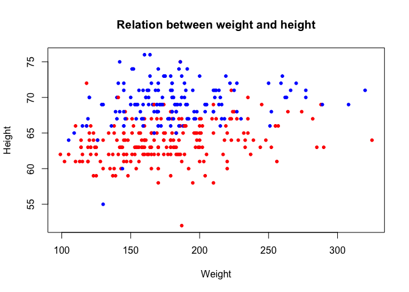<!-- -->

How did this happen? Despite the factor that the column `gender` looks like character strings, internally, R considers the values as integers: the first level (female) corresponds to 1, the second level (male) corresponds to 2.
Check what happens here:


```r
col.vec[c(1, 2, 2, 1, 2, 1, 1)]
```

```
[1] "red"  "blue" "blue" "red"  "blue" "red"  "red" 
```

Passing a vector of 1 and 2 to the color vector selects the corresponding element; hence, since `dat$gender` is internally considered a vector of 1's and 2's, the same happens: for female patients, the first element is selected (red), for males the second (blue):


```r
col.vec[dat$gender]
```

```
  [1] "red"  "red"  "red"  "red"  "red"  "red"  "red"  "red"  "red"  "red" 
 [11] "red"  "red"  "red"  "red"  "red"  "red"  "red"  "red"  "red"  "red" 
 [21] "red"  "red"  "red"  "red"  "red"  "red"  "red"  "red"  "red"  "red" 
 [31] "red"  "red"  "red"  "red"  "red"  "red"  "red"  "red"  "red"  "red" 
 [41] "red"  "red"  "red"  "red"  "red"  "red"  "red"  "red"  "red"  "red" 
 [51] "red"  "red"  "red"  "red"  "red"  "red"  "red"  "red"  "red"  "red" 
 [61] "red"  "red"  "red"  "red"  "red"  "red"  "red"  "red"  "red"  "red" 
 [71] "red"  "red"  "red"  "red"  "red"  "red"  "red"  "red"  "red"  "red" 
 [81] "red"  "red"  "red"  "red"  "red"  "red"  "red"  "red"  "red"  "red" 
 [91] "red"  "red"  "red"  "red"  "red"  "red"  "red"  "red"  "red"  "red" 
[101] "red"  "red"  "blue" "blue" "blue" "blue" "blue" "blue" "blue" "blue"
[111] "blue" "blue" "blue" "blue" "blue" "blue" "blue" "blue" "blue" "blue"
[121] "blue" "blue" "blue" "blue" "blue" "blue" "blue" "blue" "blue" "blue"
[131] "blue" "blue" "blue" "blue" "blue" "blue" "blue" "blue" "blue" "blue"
[141] "blue" "blue" "blue" "blue" "blue" "blue" "blue" "blue" "blue" "blue"
[151] "blue" "blue" "blue" "blue" "blue" "blue" "blue" "blue" "blue" "blue"
[161] "blue" "blue" "blue" "blue" "blue" "blue" "blue" "blue" "blue" "blue"
[171] "blue" "blue" "blue" "blue" "blue" "red"  "red"  "red"  "red"  "red" 
[181] "red"  "red"  "red"  "red"  "red"  "red"  "red"  "red"  "red"  "red" 
[191] "red"  "red"  "red"  "red"  "red"  "red"  "red"  "red"  "red"  "red" 
 [ reached getOption("max.print") -- omitted 166 entries ]
```

> Plot the patients from Buckingham as green dots, and the ones from Louisa in orange!


<details>
<summary><b>Click here for the solution!</b></summary>


```r
## first build a vector with the colors needed
col.vec = c('green','orange')

## now make the scatter plot
plot(dat$weight,dat$height,
     xlab='Weight',ylab='Height',
     pch=20,
     col=col.vec[dat$location],  ## this is the important line here...
     main='Relation between weight and height')
```
</details>


## 4.6 Heatmaps

Matrices containing numerical values are usually displayed as heatmaps; each numerical entry in the matrix is displayed using a color, which makes the interpretation very easy!
This makes sense if the columns of the numerical matrix have comparable ranges. For example, the `age` and `weight` variables here have very different ranges, so it might be difficult to represent this by the same color scale. However, if we would have gene expression data, then we could use a heatmap.

Here, we will compute the correlations between all numerical values in the matrix, and then display the correlation matrix using a heatmap.

We first extract the numerical variables


```r
dat.num = dat %>% select(where(is.numeric))
```

We now compute the pairwise correlation between the columns. We have previously used the `cor` function to compute the correlation between 2 vectors. However, this is an 'intelligent' function. If instead of giving 2 vectors as entries, we give a numerical matrix, the function will understand that we want to compute all pairiwise correlation values!


```r
all.cor = cor(dat.num)
all.cor
```

```
                 chol    stab.glu           hdl       ratio       glyhb
chol      1.000000000  0.16544754  0.1709732770  0.48403807  0.27165218
stab.glu  0.165447544  1.00000000 -0.1801048833  0.29889570  0.74090490
hdl       0.170973277 -0.18010488  1.0000000000 -0.69023141 -0.16949641
ratio     0.484038069  0.29889570 -0.6902314087  1.00000000  0.35465342
glyhb     0.271652180  0.74090490 -0.1694964128  0.35465342  1.00000000
age       0.241604908  0.27855141  0.0002152264  0.17156914  0.33222989
height   -0.063230009  0.08247570 -0.0685918173  0.07089817  0.05225072
weight    0.079789987  0.18880052 -0.2829826752  0.27889889  0.16776851
bp.1s     0.201948705  0.15142542  0.0295089053  0.10534657  0.19442279
bp.1d     0.159042299  0.02569721  0.0722451474  0.03484142  0.04786459
waist     0.144089547  0.23369209 -0.2783001009  0.31549761  0.24768684
hip       0.098597154  0.14483314 -0.2222166064  0.20789160  0.15167273
time.ppn  0.006238501 -0.04845774  0.0799388429 -0.05382831  0.03704938
                   age       height      weight       bp.1s       bp.1d
chol      0.2416049084 -0.063230009  0.07978999  0.20194870  0.15904230
stab.glu  0.2785514141  0.082475702  0.18880052  0.15142542  0.02569721
hdl       0.0002152264 -0.068591817 -0.28298268  0.02950891  0.07224515
ratio     0.1715691447  0.070898165  0.27889889  0.10534657  0.03484142
glyhb     0.3322298936  0.052250721  0.16776851  0.19442279  0.04786459
age       1.0000000000 -0.097136587 -0.04621299  0.43303227  0.05891477
height   -0.0971365873  1.000000000  0.24329556 -0.04441181  0.04345208
weight   -0.0462129859  0.243295558  1.00000000  0.09624288  0.18050511
bp.1s     0.4330322675 -0.044411815  0.09624288  1.00000000  0.61984558
bp.1d     0.0589147673  0.043452076  0.18050511  0.61984558  1.00000000
waist     0.1702608196  0.041807866  0.85192261  0.20976399  0.17899079
hip       0.0182966937 -0.117181984  0.82984527  0.15142640  0.16282460
time.ppn -0.0269049474 -0.006180895 -0.06221671 -0.07490369 -0.06376264
               waist         hip     time.ppn
chol      0.14408955  0.09859715  0.006238501
stab.glu  0.23369209  0.14483314 -0.048457737
hdl      -0.27830010 -0.22221661  0.079938843
ratio     0.31549761  0.20789160 -0.053828314
glyhb     0.24768684  0.15167273  0.037049379
age       0.17026082  0.01829669 -0.026904947
height    0.04180787 -0.11718198 -0.006180895
weight    0.85192261  0.82984527 -0.062216714
bp.1s     0.20976399  0.15142640 -0.074903689
bp.1d     0.17899079  0.16282460 -0.063762636
waist     1.00000000  0.83233707 -0.065861241
hip       0.83233707  1.00000000 -0.092519540
time.ppn -0.06586124 -0.09251954  1.000000000
```

Since all correlation values are between -1 and 1, a heatmap is perfectly adapted here! We can use the built-


```r
heatmap(all.cor)
```

<!-- -->

See how the columns and rows have been clustered automatically.

The default colors are ugly... especially, we would like to use a **symmetrical color palette**, with a different color for the positive and negative values!

We introduce now a wonderful package, [**RColorBrewer**](https://rdrr.io/cran/RColorBrewer/man/ColorBrewer.html), which offers a plethora of beautiful colo palettes


```r
library(RColorBrewer)
```


```r
## 10 colors from the PiYG palette
col.cor = brewer.pal(10, "PiYG")

## we can extrapolate to more colors shades
col.cor = colorRampPalette(col.cor)(100)
```


```r
heatmap(all.cor, col = col.cor, scale = "none")
```

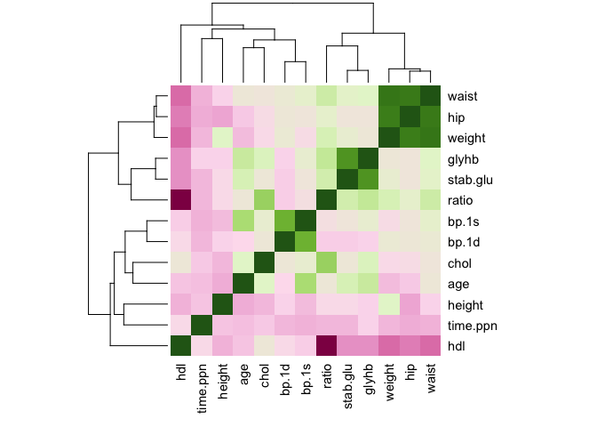<!-- -->

We can use another package, which has a lot of additional functions


```r
library(pheatmap)
```


```r
pheatmap(all.cor, col = col.cor)
```

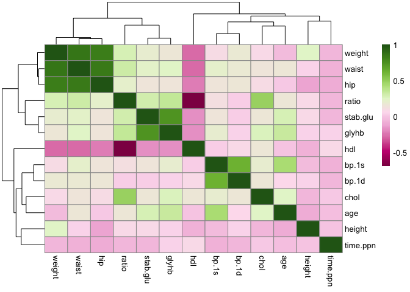<!-- -->


### Exercise: plotting expression values

<blockquote>

1. Load the matrix of expression values from an ALL/AML patients

```r
## read the expression values
all.aml = read.delim("https://tinyurl.com/4w6n3x9k", header = TRUE)
## read the annotation table
all.aml.anno = read.delim("https://www.dropbox.com/s/rxw02jry9y6wgwk/all.aml.anno.csv?dl=1", 
    header = TRUE)
```

2. Check the type of the `all.aml` object using `type`; as the heatmap function only accepts the type `matrix`, you need to convert the object using the function `data.matrix()`!

3. Use the  `pheatmap` function to plot the expresion matrix as a heatmap; check the meaning of the `scale=...` argument

4. use the `annotation_col=...` argument, and pass the annotation data frame, to add some additional information about the patients!

</blockquote>

<details>
<summary><b>Click for solution!</b></summary>

```r
## plotting the expression values

library(pheatmap)

pheatmap(all.aml,show_rownames=FALSE)
```

Well, this is not really nice, because all the expression values (almost) are blue. This is due to the distribution of the values, which is very skewed!

```r
## exemplarily for patient 10
plot(density(all.aml[,10]))
```

The solution would be to log transform the data:

```r
pheatmap(log(all.aml+1),show_rownames=FALSE) # the +1 is to avoid error if one entry is 0!
```

We can add annotations for the patients

```r
pheatmap(log(all.aml+1),show_rownames=FALSE,annotation_col=all.aml.anno) 
```

</details>


[Previous Chapter (Cleaning the dataset)](./03_cleanup.md)|
[Next Chapter (Hypothesis testing)](./05_test.md)
