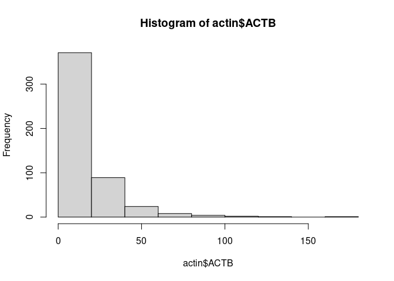

# 1. Standard Preprocessing using Seurat


Some standard steps are usually carried out in scRNA-Seq prior to further analysis as QC, dimensional
reduction and marker visualization. Here, we will use the Seurat R package to perform these steps which
is increasingly becoming the most popular tool, however, there are some other options as SingleCellExperiment
in R and scanpy available for python. First, we need to define a Seurat object.


## Creating Seurat object

We create a Seurat object using the `CreateSeuratObject` function as follows. Use the `?function` helper
in R to get information about the parameters that are need to be provided to the function.

 * counts - a count matrix. It can be a matrix, sparse matrix or dataframe.
 * project - A single character string. Correspond to a arbitrary name to label the object.
 * assay - A single character string. An arbitrary name that usually is assigned to label the
            type of sequencing information, for example, RNA, spliced RNA, ATAC, etc...
 * min.cells - An integer. Indicates a threshold of the number of cells for which a feature was
              recorded. Cells below that threshold will be filtered out.
 * min.features - An integer. Similar to min cells but for the number of features of a cell.
 


```r
library(Seurat)

pbmc.seurat <- CreateSeuratObject(
  counts = pbmc.mtx, 
  project = 'PBMC', 
  assay = 'RNA', 
  min.cells = 1, 
  min.features = 1
)
```

The variable `pbmc.seurat` now contains the Seurat object that we can feed into the package.
If we print the variable we get information about the number of genes and cells.


```r
pbmc.seurat
```

```
## An object of class Seurat 
## 12673 features across 500 samples within 1 assay 
## Active assay: RNA (12673 features, 0 variable features)
```

## Exploring the Seurat object


Seurat objects can be seen as a container of different features. At this step it contains
our gene expression matrix, but in addition it can store metadata, processed data,
information from different assays, for example, scATACSeq, scCITESeq or unspliced transcripts.

There are two options to explore the content of the object:

1. **direct access** to the data slots (Equivalent to: you go to your Kleiderschrank, open the cupboard, then the drawer inside, then the box, and get your socks out)

2. using **accessor functions** (Equivalent to: "Alexa! get my socks!"). Check out [this page](https://satijalab.org/seurat/articles/essential_commands.html) to have an overview of the different accessor functions for Seurat objects!


We can start exploring the seurat object using the `$` to explore its *metadata* in combination with the tab 
key. For example, during the creation of the seurat object the number of counts quality metric
is calculated and added to the metadata. We can explore this metric by accessing the metadata
as follows.


```r
pbmc.seurat$nCount_RNA %>% head
```

```
## AAAGAGACGGACTT-1 AAAGATCTGGGCAA-1 AAAGCAGATATCGG-1 AAAGTTTGATCACG-1 
##             1151             1347             4584             1268 
## AAATCAACCCTATT-1 AAATGTTGTGGCAT-1 
##             5676             2761
```

 We can do the same with the `@` operator to explore the different *slots*. For example,
 we can extract the original count matrix that we used to create the seurat object as follows:
 
 

```r
pbmc.seurat@assays$RNA@counts[1:5, 1:5]
```

```
## 5 x 5 sparse Matrix of class "dgCMatrix"
##            AAAGAGACGGACTT-1 AAAGATCTGGGCAA-1 AAAGCAGATATCGG-1 AAAGTTTGATCACG-1
## AL627309.1                .                .                .                .
## AP006222.2                .                .                .                .
## LINC00115                 .                .                .                .
## NOC2L                     .                .                .                .
## PLEKHN1                   .                .                .                .
##            AAATCAACCCTATT-1
## AL627309.1                .
## AP006222.2                .
## LINC00115                 .
## NOC2L                     .
## PLEKHN1                   .
```


## Extracting expression values 


Next, we visualize gene counts to see its behavior. We take a look at the expression of the 
house keeping gene ACTIN Beta and plot an histogram of count values. We will use the
the function `FetchData` which is used to extract values from selected features in the Seurat
object and then plot it using an histogram.


```r
actin <- FetchData(pbmc.seurat, vars = 'ACTB')
hist(actin$ACTB)
```




## Quizzes

<br>
<details>
<summary> Find and display the metadata in the seurat object
<br>
TIP: You can have 
a look at the [documentation](https://github.com/satijalab/seurat/wiki/Seurat#object-information) 
of the seurat objects from the GitHub Wiki.
</summary>
<br>
<b>Answer:</b>
<br>

```r
pbmc.seurat@meta.data %>% head
```

</details> 


## Exercises

<blockquote>
Create a Seurat object 

The file in the following URL:

`https://raw.githubusercontent.com/caramirezal/caramirezal.github.io/master/bookdown-minimal/data/pbmc_10X_250_cells.tsv` 

contains 250 cells downsampled from the 10x PBMC data and stored in tsv format

 * Load the count matrix in tsv format
 
 * Create a Seurat object using the count matrix
 
 * How many features and cells are present in the count matrix?

</blockquote>


[Previous Chapter](./00.md)|
[Next Chapter](./02.md)