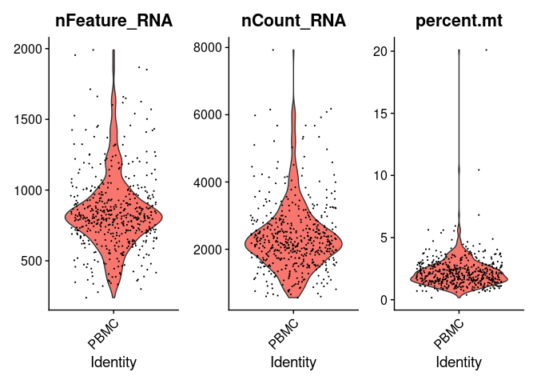

---
output:
  html_document:
    keep_md: yes
---


# 2. Quality control


Filtering cells with low sequencing quality is a very important step since it can greatly
impact in further analysis. Quality check and control often requires to visualize and inspect
samples in order to determine appropiate thresholds. Threshold values might vary from one 
dataset to another, so no hard threshold rule can be applied equally to every case.

We will examine the number of UMI counts, the number of RNA features and the percentage of reads 
of mitochondrial genes.

We will first calculate the percentage of UMI counts of reads mapped to mitochondrial genes. This
step most be manually done since is based on a *priori knowledge* of which genes corresponds to
mitochondrial genes. 
In this case, genes are annotated using human ensembl gene symbol annotations mitochondrial 
genes are annotated starting with a `MT-` string.


```r
pbmc.seurat[["percent.mt"]] <- PercentageFeatureSet(pbmc.seurat, pattern = "^MT-")
```

Then, we can visualize the following metrics.

 * Number of features - Correspond to the number of different mapped genomic features. For example, in the
 case of scRNA-Seq features corresponds to genes, in ATAC-Seq to genomic ranges, etc. High number of features
 can indicate doublets and empty cells. Usually between 1 and 30000.
 
 * Number of counts - Number of mapped reads. It can also indicate the presence of doublets and empty 
droplet. It's generally correlated to the number of features. Usually between 1 and 20000.
 
 * Percentage of mitochondrial genes - Percentage of mapped reads that are annotated to mitochondrial
 genes. The presence of high levels of % of mitochondrial genes can suggest that a cell have lost
 its membrane integrity or that the cytoplasm has been leaked off and only the mitochondria was retained.
Usually a range from 0 to 10 is aceptable.


We can plot these metrics using the function `VlnPlot()` as follows:


```r
VlnPlot(pbmc.seurat, features = c('nFeature_RNA', 'nCount_RNA', 'percent.mt'))
```



The violin plots show the values of the metrics for each cell along with an adjusted violin 
distribution.

## Filtering out cells

Based on the previous violin plots we can define some thresholds and filter out cells using
the `subset` function. In the following code we select cells having nFeatures < 1250, 
nCount < 4000 and percentage of reads mapped to mitochondrial genes < 5 percent.


```r
pbmc.filtered <- subset(pbmc.seurat, 
                           nFeature_RNA < 1250 &
                                nCount_RNA < 4000 & 
                                    percent.mt < 5)
```

We can check the number of cell that passed the QC.


```r
ncol(pbmc.filtered)
```

```
## [1] 452
```

## Quizzes

<br>
<details>
<summary> *How are the number of features and UMI counts related?* 
<br>
TIP: Use the function FeatureScatter, inspect the manual using ?function.
</summary>
<br>
<b>Answer:</b>
<br>
`FeatureScatter(pbmc, feature1 = "nCount_RNA", feature2 = "nFeature_RNA")`
<br>


We observe as expected a linear relation between the number of UMI counts and the 
features recorded.
</details> 


## Exercises


> Performing your own QC

Perform a QC using the downsampled 10 PBMC 250 cells data

* Calculate and visualize QC metrics
* Filter out cells based on the calculated values


## Normalization

There are several methods for normalization of scRNA-Seq data. A commonly
used strategy is the log normalization which basically corrects sequencing
deep in cells by dividing each feature by the total number of counts and
then multiplied the result by a factor, usually 10000, and finally the
values are log transformed.

Log normalization can be implemented by using the `NormalizeData()` function.


```r
pbmc.filtered <- NormalizeData(pbmc.filtered)
```

Then, in order to make genes measurements more comparable log transformed
values are scaled in a way that the media is equal to zero and the variance
is equal to 1 as follows:


```r
pbmc.filtered <- ScaleData(pbmc.filtered)
```

