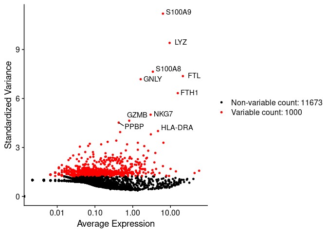

---
output:
  html_document:
    keep_md: yes
---


# 3. Feature selection


Because of the sparsity in the sequencing data many genes or features are almost no expressed.
Additionally, some genes are constantly expressed across cells. These features are then probably
not playing any function in cells and on the other hand can just add noise and unnecessary complexity
to further analysis. Then, it's usual to remove genes with very low variability and to select
only top highly variable genes (HVG).

We will use the function `FindVariableFeatures()` to calculate the top most variable genes.
The parameter nfeatures is used to set the number of top selected genes. We set to the top
1000 features.


```r
pbmc.filtered <- FindVariableFeatures(pbmc.filtered, nfeatures = 1000)
```


We can access to the top 1000 variable features using the VariableFeatures function. In the next
chunk we display the top first 6 (head) of this set. 


```r
head(VariableFeatures(pbmc.filtered))
```

```
## [1] "S100A9" "LYZ"    "S100A8" "FTL"    "GNLY"   "FTH1"
```


In the next scatter plot we can see the average expression *vs* the standardized variance for each feature.
Genes in red are the selected HVG.


```r
# plot variable features with and without labels
plot1 <- VariableFeaturePlot(pbmc.filtered)
plot1 <- LabelPoints(plot = plot1, 
                     points = head(VariableFeatures(pbmc.filtered),
                                   10), 
                     repel = TRUE)
plot1 
```



For further analysis we will use only HVGs. 

## Exercises

> Extract normalized expression values and calculate the variance in genes and order them
by variance.

* Extract the matrix of gene expression normalized values from the Seurat object
* Calculate variances manually from the matrix
* Sort genes based on variances in decreasing order and show top 6 genes


