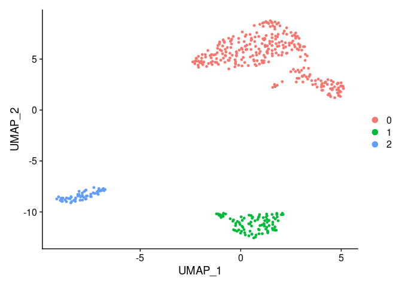

# 5. Cell clustering


Detection of groups or cluster of cells is an important task in scRNA-Seq 
analysis. Seurat implements a clustering method based in KNN graphs and 
community detection using the Louvain algorithm. An important parameter
for clustering is the resolution which can be set to increase/reduce the
granularity of the clusters.

This method can be implemented by using the functions `FindNeighbors()` and
`FindClusters()` as follows:


```r
pbmc.filtered <- FindNeighbors(pbmc.filtered)
pbmc.filtered <- FindClusters(pbmc.filtered, 
                            resolution = 0.1, 
                            verbose = FALSE)
```


The results of the clustering are stored in the Seurat metadata slot, which
can be accessed as a simple data.frame using the `$` operator. A column vector
containing each cluster for each cell is name `seurat_cluster` as shown next:


```r
head(pbmc.filtered$seurat_clusters)
```

```
## AAAGAGACGGACTT-1 AAAGTTTGATCACG-1 AAATGTTGTGGCAT-1 AAATTCGAGCTGAT-1 
##                0                2                1                1 
## AAATTGACTCGCTC-1 AACAAACTCATTTC-1 
##                0                0 
## Levels: 0 1 2
```


There are 5 different clusters, labeled from 0 to 4 and stored like a factor.
We can plot a frequency table of the number of cells assigned to each cluster
by the algorithm.


```r
table(pbmc.filtered$seurat_clusters) 
```

```
## 
##   0   1   2 
## 297  95  60
```

So, 297 cells were assigned to the cluster 0.

## Exercises

<blockquote>
Testing clustering: Try different different parameters for the clustering. For example,
`k.param` in the *FindNeighbors()* function and higher levels of
resolution.
</blockquote>


# Cluster visualization


Transformations like PCA, tSNE or UMAP are used to project multidimensional
data into 2D or 3D representations that can be visualized at the expense
of the lose of information. tSNE and UMAP transformations aims to preserve
global relations between sample points. We will use UMAPs to visualize the
scRNA-Seq data from PBMC.


## UMAP

We can use the `RunUMAP` function to calculate the UMAP transformation. The 
calculation of a UMAP projection can intensive computationally and is 
usually carried out on already dimensional reduced data using, for example,
PCA. The RunUMAP from seurat by default will use the PCA reduced data, the
parameter `dims` sets the number of dimensions, PCs that should be used, as
we saw we can use 7 PCs which are the ones in which there is more variability.


```r
pbmc.filtered <- RunUMAP(pbmc.filtered, 
                       dims = 1:7, 
                       verbose = FALSE)
```

After the calculation of the UMAP we can visualize it using the function
`DimPlot()`.


```r
DimPlot(pbmc.filtered)
```




## Exercise

<blockquote>

* Perform UMAP visualization with the 10x PBMC 250 cells with your own set
of parameters

* How does subsampling and parameters selection affects clustering?
</blockquote>

[Previous Chapter](./04-Normalization_and_Dimensional_Reduction.md)|
[Next Chapter](./06-Differential_Expression.md)