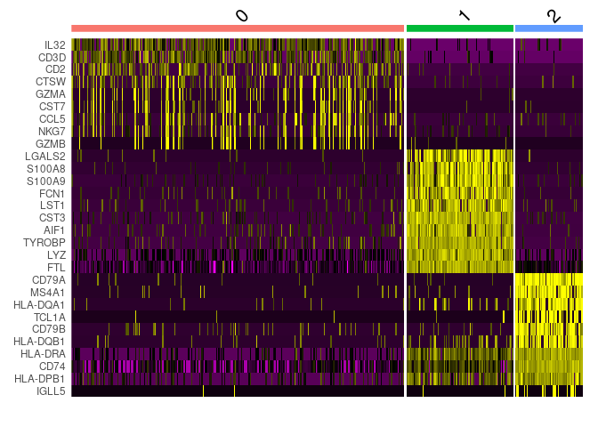
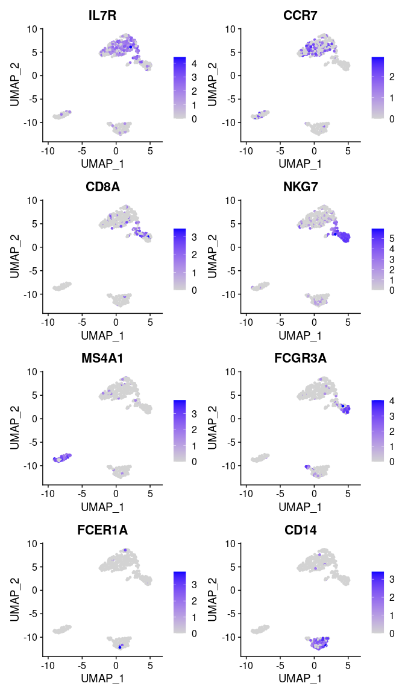
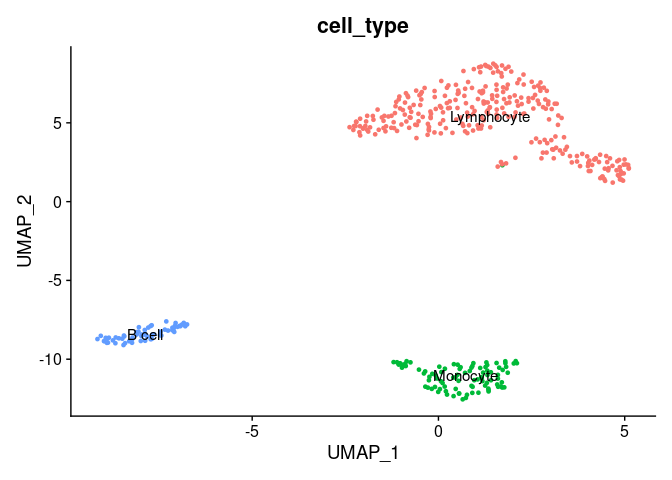
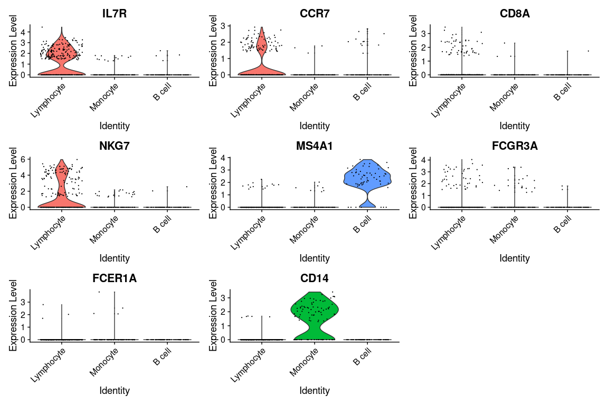
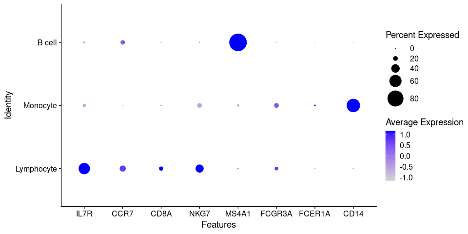

---
output:
  html_document:
    keep_md: yes
---


# 7. Markers visualization


First, we will take top 10 ranked genes based in Log FC and visualize their
expression in clusters using a heatmap representation.


```r
top10 <- pbmc.degs %>% 
             group_by(cluster) %>% 
             top_n(n = 10, wt = avg_log2FC)
DoHeatmap(pbmc.filtered, 
          features = top10$gene) + NoLegend()
```



IL-7 is a marker for naive CD4+ T cells, while GZMB is a marker for CD8 T cells.
Then, we can tentatively consider cluster 0 and 2 as CD4 and CD8 T cells,
respectively. 

We can visualize additional known canonical markers in order to assign cell
categories. 


```r
canonical_markers <- c('IL7R',     ## CD4+ cell
                       'CCR7',     ## Naive CD4+ T cell
                       'CD8A',     ## CD8+
                       'NKG7',     ## NK
                       'MS4A1',    ## B cell marker
                       'FCGR3A',   ## Mono
                       'FCER1A',   ## DC
                       'CD14'     ## Mono
                       )

FeaturePlot(pbmc.filtered, 
            features = canonical_markers,
            ncol = 2)
```



Now, we will annotate the cells with their identified identities in the seurat 
object. We will map the cluster names as follows:


```r
mapping <- data.frame(seurat_cluster=c('0', '1', '2'),
                      cell_type=c('Lymphocyte', 
                                  'Monocyte', 
                                  'B cell'))
mapping
```

```
##   seurat_cluster  cell_type
## 1              0 Lymphocyte
## 2              1   Monocyte
## 3              2     B cell
```

To assign the new labels we can use the map function from the plyr R package
as follows:


```r
pbmc.filtered$'cell_type' <- plyr::mapvalues(
  x = pbmc.filtered$seurat_clusters,
  from = mapping$seurat_cluster,
  to = mapping$cell_type
)
```


Now, we can plot the clusters with the assigned cell types.


```r
DimPlot(pbmc.filtered, 
        group.by = 'cell_type',   ## set the column to use as category
        label = TRUE)  +          ## label clusters
        NoLegend()                ## remove legends
```




## Visualization of gene expression levels of markers in clusters

We can visualize the expression of the different markers across identified clusters
using violin plots using the `VlnPlot()` function as follows:


```r
VlnPlot(pbmc.filtered, 
        features = canonical_markers,
        group.by = 'cell_type')
```




Because of the signal dropout it's hard to say what is the proportion of cells that are actually
expressing a marker. Dotplots are commonly used to visualize both gene expression levels alongside 
with the frequency of cells expressing the marker. The `DotPlot()` function comes at handy.


```r
DotPlot(pbmc.filtered, 
        features = canonical_markers, 
        group.by = 'cell_type', 
        dot.scale = 12)
```




## Exercises

<blockquote>
Provide a report of all your findings (QC, clustering) including plots, parameter selection
and conclusions using the 10x PBMC 250 subsampled data.

Using the scRNA-Seq workflow that we have seen analize a dataset of PBMC cells stimulated
with IFN beta. 

* Load the seurat object containing the data to a variable named `ifnb` using the following commands:

```r
url_ifn <- 'https://github.com/caramirezal/caramirezal.github.io/blob/master/bookdown-minimal/data/pbmc_ifnb_stimulated.seu.rds?raw=true'
ifnb <- readRDS(url(url_ifn))
```

* This data is downsampled from the [Kang HM et al, 2017 data](https://www.nature.com/articles/nbt.4042).
* Provide a report in a Rmd file.   

</blockquote>

[Previous Chapter](./06.md) | 

