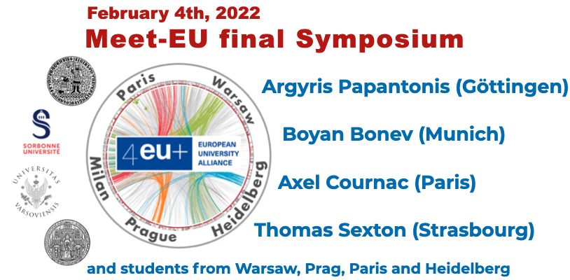

Check out the [program](./final-program.pdf) and [register here](https://forms.gle/h11yEZ2pwzZhHYGs8) *(a link will be sent to you prior to the meeting)*.

**Subject:** The topic of the course deals with the inferrence of chromatin organization from Hi-C data. 
The students conceived, designed, developed, tested and validated a computational program to predict 
compartments and topologically associating domains (TAD) starting from Hi-C matrices. 
The latter come from different cell types and display different resolutions.

**Open questions:** 
How does the resolution influence compartment detection? Can we improve TAD detection using epigenetic marks? 
Can we define more than two compartments? Can we define a classification of TADs?

**Expected product:** Each team is in charge of one of the two tasks, either compartment detection or TAD detection. 
The teams pair up halfway through the project and have to critically assess the results of their partner team.

**Jury members and keynote speakers:** [A. Papantonis](https://www.uni-goettingen.de/en/595200.html) (University Göttingen), [A. Cournac](https://research.pasteur.fr/en/member/axel-cournac/)
(Institut Pasteur, Paris), [B. Bonev](https://www.bonevlab.com/) (Ludwig-Maximilians-University, Munic), 
[T. Sexton](https://www.igbmc.fr/equipes/organisation-spatiale-du-genome) (IGBMC, Strasbourg).

**Students curriculum:** Bioinformatics@CharlesUni, Biotechnology@UniHeidelberg, BIM@SU, and Bioinformatics and System biology@UniWarsaw.

**Teachers (non-exhaustive list):** J. Bernardes@SU, L. Carron@SU, C. Herrmann@UniHeidelberg, E. Laine@SU, M. Novotny@CharlesUni and M. Machnika@UniWarsaw.

