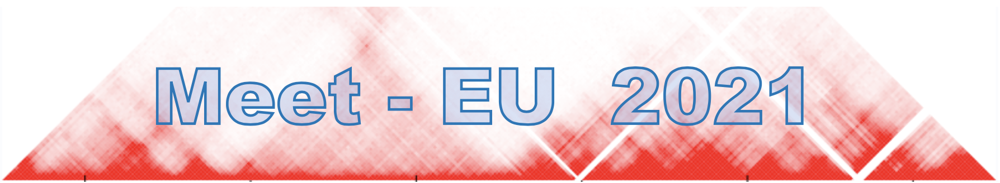

Following the successfull 2020 Edition of Meet-EU, we are renewing the experience in 2021/2022, with the contribution of student teams from Heidelberg, Milano, Paris, Prag and Warsaw.

**Contacts**

* Alessandra Carbone (Paris Sorbonne)
* Leopold Carron (Paris Sorbonne)
* Elodie Laine (Paris Sorbonne
* Carl Herrmann (Heidelberg University)

*********
## Topic

Similar to the 2020 edition, the topic of this years edition will be on the **prediction of chromatin structure (topological associated domains and chromatin compartments) from Hi-C data**. Data integration will play an important role, as additional datasets will be provided.

There are two sub-projects:

#### 1. Prediction of topological associated domains (TADs) based on the Hi-C data

Possible questions could be how important TADs are for gene expression? Are they related to other chromosomal organisation structures? Can we define a classification of TADs? What are the epigenetic marks that can help in that task? How do the parameters influence the detection?

#### 2. Prediction of compartments that represent active or repressed states of chromatin

The classical resolution for detecting compartments is 100 kb. What if we increase that resolution? Can we extract more meaningful information? Can we detect the compartments based on inter-chromosomal contacts (instead of intra)? What are the biological implications? Can we define more than two compartments? What kind of epigenetic markers can help us determine a meaningful number and meaningful boundaries?

[Link to the page with further details](https://github.com/hdsu-bioquant/meet-eu-2021)

*********
## Organisational principles

* Students who want to participate will work in **teams of up to 4 students**
* In the course of the project, teams will be paired across univiersities, in order to compare results. 
* Datasets and scripts will be provided, and computing resources will be allocated locally to each team.

*********
## Important dates

* The **kick-off presentation** for all teams will take place online on **Tuesday, October 12th at 2pm** *(link will be sent)*
* The **mid-term presentations** will take place on **December, 17th**
* The **one-day final workshop** will take place in **Heidelberg** on **February, 4th** . As last year, keynote speakers will give lectures and contribute to evaluate the student projects.
* Lectures will be over **Zoom** (we will send the link via email prior to the course)

